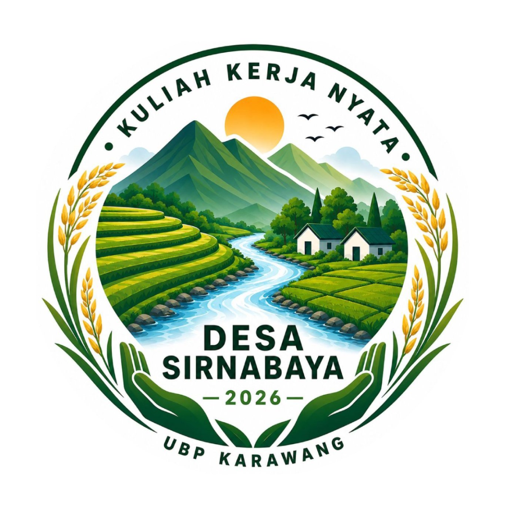

<div align="center">



# Portal Berita KKN Desa Sirnabaya 2026

**Universitas Buana Perjuangan Karawang**

Portal berita dan dokumentasi program kerja KKN Desa Sirnabaya 2026 yang terhubung dengan Google Spreadsheet, Google Drive, dan Google Apps Script.

[Website Utama](https://ubpkknsirnabaya2026-dev.github.io/) · [Portal Dusun Kalihurip](https://ubpkknsirnabaya2026-dev.github.io/dusunkalihurip-desasirnabaya/) · [Instagram](https://www.instagram.com/kknsirnabaya26/) · [TikTok](https://www.tiktok.com/@kk.desa.sirnabaya5)

</div>

---

## Tentang Website

Website ini menjadi pusat publikasi kegiatan KKN Desa Sirnabaya 2026. Setiap program kerja ditampilkan dalam bentuk artikel berita yang memuat:

- Judul dan narasi kegiatan
- Tanggal serta lokasi pelaksanaan
- Foto sampul berita
- Nama dan portrait mahasiswa pelaksana
- Dokumentasi foto dan video
- Tautan menuju Portal Dusun Kalihurip

Konten berita tidak ditulis langsung di dalam HTML. Data diambil secara dinamis dari Google Spreadsheet dan Google Drive melalui Google Apps Script.

---

## Teknologi

| Bagian | Teknologi |
|---|---|
| Hosting frontend | GitHub Pages |
| Tampilan website | HTML, CSS, JavaScript |
| Backend API | Google Apps Script |
| Database konten | Google Spreadsheet |
| Penyimpanan media | Google Drive |

---

## Arsitektur Sistem

```text
GitHub Pages
     │
     │ Fetch JSON
     ▼
Google Apps Script
     │
     ├── Google Spreadsheet
     │   ├── Anggota
     │   └── Berita
     │
     └── Google Drive
         ├── Portrait anggota
         └── Dokumentasi berita
